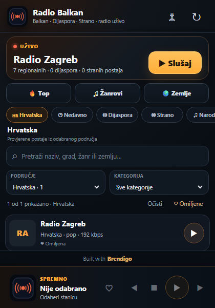

<p align="center">
  
</p>

<h1 align="center">Radio Balkan</h1>

<p align="center"><strong>Radio iz Hrvatske i regije. Jedan brend. Windows, Android i preglednici.</strong></p>

<p align="center">
  
  
  
  
</p>

Radio Balkan je lagani radio player napravljen za brzo slušanje stanica iz Hrvatske i regije bez korisničkog računa, bez telemetry sustava i bez teškog web runtimea u Windows aplikaciji. Projekt objedinjuje nativni Windows klijent, nativni Android klijent i produkcijske ekstenzije za Chrome, Edge, Opera i Firefox.

## Zašto Radio Balkan

- **Brz start i mali resursni otisak** — ograničeni cachevi, workeri i response limiti štite RAM i CPU.
- **Jednostavno slušanje** — pretraga, države, žanrovi, omiljene stanice i stalni player.
- **Stabilniji streamovi** — timeouti, recovery i fallback putanje smanjuju zaglavljivanje na neispravnim izvorima.
- **Privatnost po dizajnu** — nema računa, behavioral trackinga ni telemetry SDK-a.
- **Zaključan identitet ekstenzija** — browser build namjerno odbija promjenu kanonskog brenda **Radio Balkan** i ne nudi rebranding postavke.
- **Jedan GitHub repozitorij** — source, build automatizacija, dokumentacija, vizualni identitet i distribucijski artefakti na jednom mjestu.

## Aplikacije

| Platforma | Implementacija | Fokus |
|---|---|---|
| Windows | nativni Win32 + Go | mali executable, Portable + Setup, bez Electrona |
| Android | nativni Java/Android | foreground player servis, lifecycle cleanup, ograničen bitmap cache |
| Chrome / Edge / Opera | Manifest V3 | zajednički UI + Chromium offscreen audio |
| Firefox | WebExtension | isti UI i katalog, Firefox playback sloj |

## Vizualni identitet

<p align="center">
  
</p>

Službeni znak i paleta nalaze se u [`assets/brand`](assets/brand). Browser manifesti, toolbar naziv i produkcijski build guard zaključani su na **Radio Balkan**.

## Snimke stvarnih aplikacija

GitHub workflow `Product screenshots` pokreće stvarni Windows binary. Browser snimka koristi isti produkcijski popup HTML/CSS/JavaScript iz `extensions/shared`, uz izolirani CI-only runtime adapter koji se ubacuje samo u privremenu preview kopiju i nikada se ne paketira u produkcijsku ekstenziju.

<p align="center">
  <br><br>
  
</p>

## Preuzimanje

Gotovi v0.0.16 artefakti objavljuju se izravno kroz [GitHub Releases](https://github.com/bren-wp/Radio-Balkan/releases/tag/v0.0.16):

- Windows Portable x64
- Windows Setup x64
- Chrome ekstenzija
- Edge ekstenzija
- Opera ekstenzija
- Firefox ekstenzija
- Android release APK kada su signing secrets konfigurirani; u suprotnom jasno označen unsigned release APK
- verificirani SHA-256 manifest

Android release APK generira GitHub Actions iz sourcea u [`apps/android`](apps/android). Potpisani javni APK zahtijeva signing secrets u GitHubu; privatni ključ se nikada ne sprema u repozitorij.

## Struktura repozitorija

```text
apps/
  windows/      nativna Windows aplikacija + installer
  android/      nativna Android aplikacija
extensions/     Chrome, Edge, Opera i Firefox
assets/         službeni branding i slike
docs/           arhitektura, sigurnost, privatnost, build i release dokumentacija
.github/        GitHub Actions, issue i PR predlošci
scripts/        version, security i repository provjere
```

## Build i provjere

```bash
python scripts/check_versions.py
python scripts/verify_security_contracts.py
python scripts/verify_production_ui.py
python scripts/check_clean_worktree.py
python scripts/test_release_checksums.py
python scripts/test_version_tools.py
```

Za sljedeće izdanje koristi se jedan kanonski version-bump korak, primjerice:

```bash
python scripts/bump_version.py 0.0.17
```

Prije stvarnog writea isti alat može se pokrenuti s opcijom `--dry-run`. Version bump odbija istu ili nižu SemVer verziju, preflighta sve markere, koristi atomske writeove te vraća originalne datoteke ako završna provjera ne prođe.

Detaljni build postupci: [`docs/BUILD.md`](docs/BUILD.md). GitHub Actions dodatno provjerava JavaScript, browser pakiranje, izvršne popup/Firefox player regression testove, session/epoch/revision player-state ugovore, production UI/UX ugovore, Go test/vet/build, Android unit testove, lint/release build, PowerShell screenshot tooling, sigurnosne kontrakte, checksum manifest, transactional version tooling i usklađenost verzija. Windows, Android i browser buildovi moraju ostaviti čist repository workspace u CI-ju, Publish workflowu i screenshot build fazi, a release SHA-256 manifest verificira se prije objave asseta.

## Dokumentacija

- [Arhitektura](docs/ARCHITECTURE.md)
- [Build](docs/BUILD.md)
- [Sigurnost](docs/SECURITY.md)
- [Privatnost](docs/PRIVACY.md)
- [Branding](docs/BRANDING.md)
- [Izdavanja](docs/RELEASES.md)
- [Doprinos projektu](CONTRIBUTING.md)

## Licenca

Projekt je objavljen pod [Unlicense](LICENSE), kako je definirano u repozitoriju.

<p align="center"><strong>Radio Balkan — glazba koja povezuje regiju.</strong></p>
